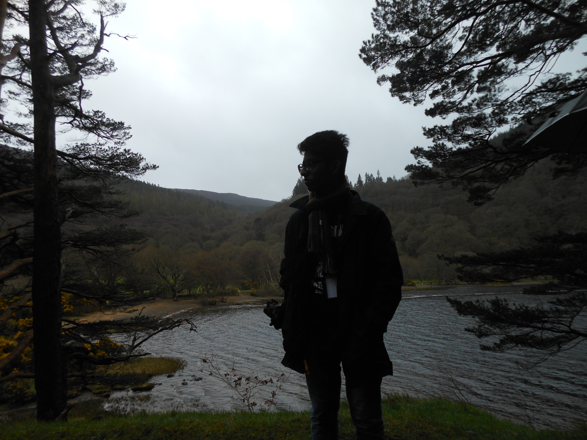

Akhil's personal page

# Akhil

  

---

## About me

Hi! I am Akhil.  
I was born in 2003 in a small town called **Madurai**, near the capital of the Tamilnadu, Chennai.  
I'm _18_ now, and I'm currently pursuing my **B.tech in computer science from IIT Goa**.  
My hobbies include drawing, watching documentaries, and reading.

  ---

## Education

|Year of graduation|Degree|Institution|
|-----|----|----|
|2025|B.Tech in CSE|IIT Goa|
|2021|12th graduation|FIITJEE Hyderabad|
|2019|10th graduation|FIITJEE Hyderabad|

  ---

## 1st year courses @ IIT Goa

#### Autumn 2021-2022

  - **MTH101:** Calculus by _Dr.Abhitosh Pandey, Dr.Sandipan De_
  - **PH101:** Quantum physics and application by _Dr.Santosh Kumar Das, Dr.Sudipta Kanungo_
  - **CS101:** Introduction to computing by _Dr.Clint P. George_
  - **CH102:** Inorganic chemistry by _Dr.Rishikesh Narayan_
  - **CH101:** Organic chemistry by _Dr. E. Siva S. Iyer_
  - **Ch104:** Chemistry lab by _Dr. E. Siva S. Iyer_
  - **CS100:** Introduction to profession by _Prof. Venkatesh Kamat_

#### Spring 2021-2022

   1.  _MTH1021:_ Basic linear algebra by Dr.Kalpesh Haria Link:https://classroom.google.com/u/0/c/NDgzOTM2ODM5OTAy
   2.  _PH102:_ Electricity and magnetism by Dr.Vaibhav Wasnik Link:https://classroom.google.com/u/0/c/NDgzNTcyNjI1MzU0
   3.  _CS102:_ Software tools by Dr.Clint P. George Link:https://clintpgeorge.github.io/cs-102/spring-2022/git/
   4.  _ME102:_ Engineering Desgin by Dr.Anirudha Ambedkar Link: https://classroom.google.com/u/0/c/NDk0MTA5MzU4Njc5
   5.  _BIO101:_ Introduction to biology by Dr.Sreenath Balakrishnan. Link:https://classroom.google.com/u/0/c/MzU0MTE1Mzk0MTAz
   

---

## Extracuricullar activities, awards, hobbies,etc.

   - Was a competitive swimmer from grades 4 to 8.
   - I can do cool tricks with a pen or pencil.
   - I like art a lot.

---